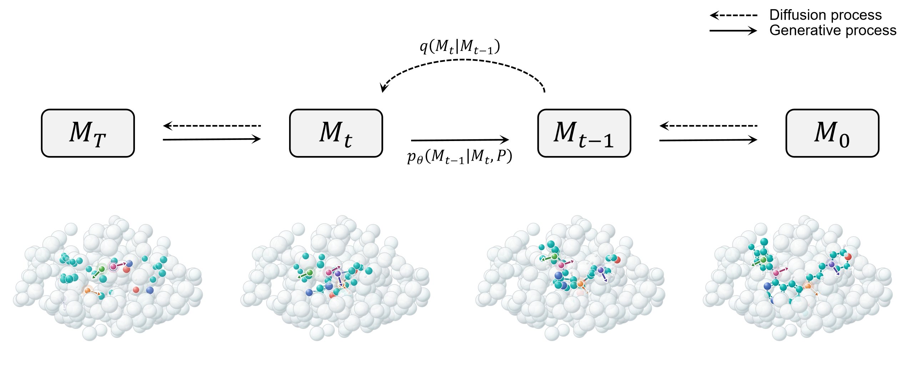
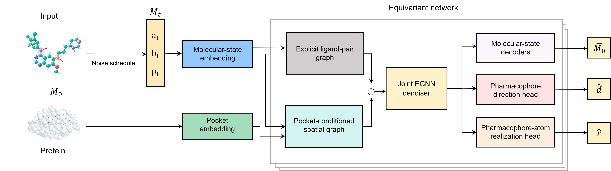
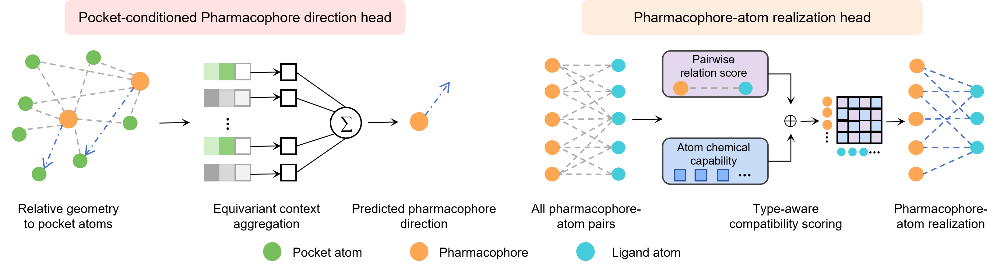

# PADiff: Function-aware pocket-conditioned molecular generation by joint ligand–pharmacophore diffusion





PADiff is a pocket-conditioned joint ligand-pharmacophore diffusion model for
structure-based molecular design. Given a processed protein pocket, it jointly
denoises ligand atom coordinates and types, candidate bond states, and six-class
pharmacophore centers and types. An equivariant orientation head predicts
directional pharmacophores, while a pharmacophore-atom realization head links
the generated functional features to the ligand atoms that can realize them.

## Environment

Install via Pip and Conda:

```bash
conda env create -f environment.yml
conda activate padiff
python -m pip install -r requirements.txt
python -m pip install git+https://github.com/Valdes-Tresanco-MS/AutoDockTools_py3
```

## Data preparation

1.The "data" folder contains model training and evaluation datasets, along with case studies focusing on protein kinases TRF1 and USP1. Download the processed dataset form this [link](https://drive.google.com/file/d/1xeAXQ9Ei9Tu__36hZgqILiBsOY73ToLf/view?usp=drive_link).

2.If you want to process the dataset from scratch, you need to download crossdocked_v1.1_rmsd1.0_pocket10 [here](https://drive.google.com/file/d/1Uk7R-04_dbHMQlY62sYlThILs7MBmW9V/view?usp=drive_link). Run preprocess_crossdocked to process the data.

```bash
python -m datasets.preprocess_crossdocked \
  --path raw_data/crossdocked_v1.1_rmsd1.0_pocket10 \
  --output data/crossdocked_v1.1_rmsd1.0_pocket10_processed.lmdb
```

To map an existing TargetDiff-compatible split blueprint onto a rebuilt LMDB:

```bash
python generate_strict_split.py \
  --raw-root raw_data/crossdocked_v1.1_rmsd1.0_pocket10 \
  --blueprint data/split_by_name.pt \
  --output data/crossdocked_pocket10_pose_split.pt
```

## Training

```bash
python train.py --config configs/train.yml --device cuda:0
```

The trained model checkpoints can be downloaded from here [link](https://drive.google.com/file/d/1zWdBrgq10xwCIbmxrPrcCkBAk_DkDeyw/view?usp=drive_link).

## Sampling

Direct sampling runs one reverse-generation pass and preserves generation order:

```bash
python sample.py \
  --config configs/sample_direct.yml \
  --checkpoint CHECKPOINT.pt \
  --outdir sample_outputs/full_direct \
  --device cuda:0
```

Adaptive sampling uses the same trained full model, resamples only the remaining
unique feasible quota, and applies post-generation candidate selection:

```bash
python sample.py \
  --config configs/sample.yml \
  --checkpoint CHECKPOINT.pt \
  --outdir sample_outputs/full_adaptive \
  --device cuda:0
```

## Evaluation

```bash
python evaluate.py \
  --config configs/eval.yml \
  --sample-path sample_outputs/full_direct \
  --result-path eval_results/full_direct
```

## Generated Molecules of PADiff

The generated molecular can be downloaded from here [link](https://drive.google.com/file/d/1uM7pZvQhEznPOhdJ79iFPu8XxDUY-E1R/view?usp=drive_link).
